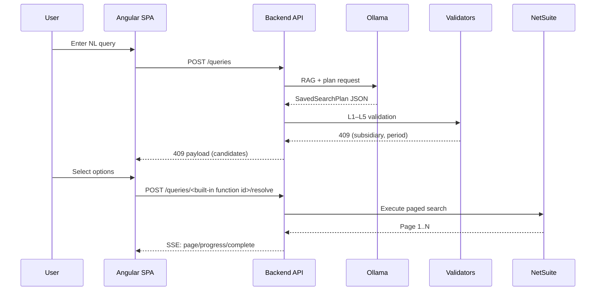
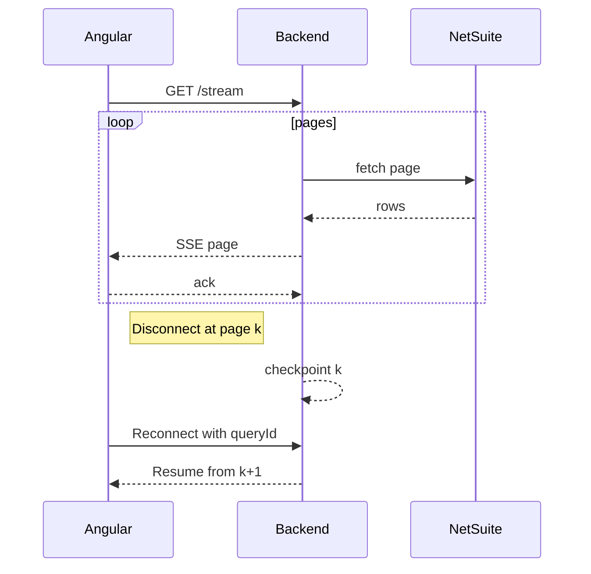
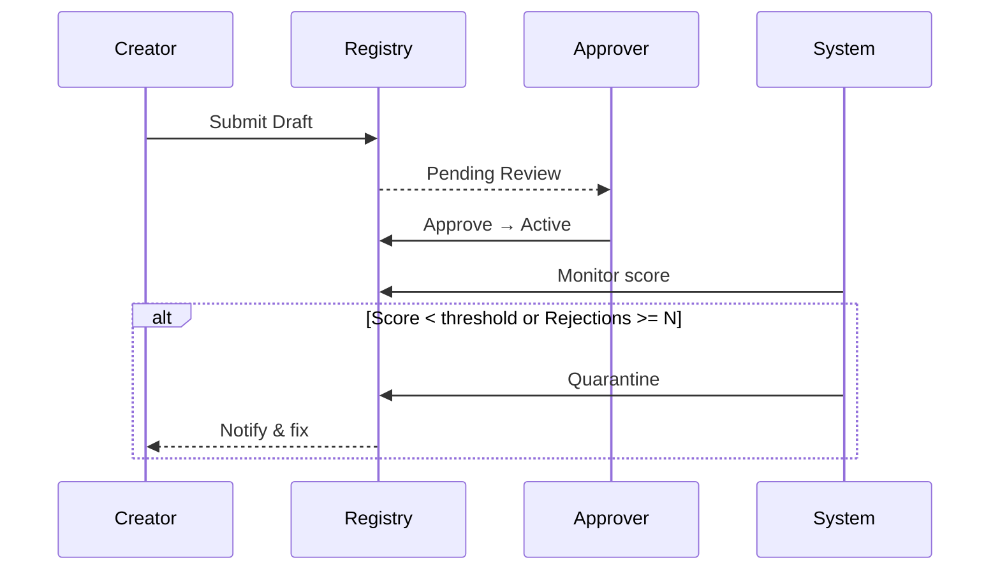

# System Architecture — v3.1 (Aligned to PRD v3.1)
**Date:** October 05, 2025

## 1. High-Level Diagram (Mermaid)
```mermaid
flowchart TB
  subgraph User["User (Browser)"]
    UI[Angular SPA]
  end

  subgraph API["Stateless API Layer"]
    GW[API Gateway/Load Balancer]
    BFF[Backend API Servers]
    SSE[SSE Manager + Backpressure]
    VAL[Validation Pipeline<br/>L1–L5 incl. Semantic]
    FLG[Feature Flag Service Client]
  end

  subgraph Intelligence["Planning & Reuse"]
    OLL[Ollama (Local LLM)]
    VDB[Qdrant (Vector DB) - Templates & Artifacts]
    TREG[Template Registry & Approval Queue]
    ATTR[Decision Attribution]
  end

  subgraph Data["Operational Stores"]
    PG[(PostgreSQL - metadata/audit)]
    RDS[(Redis - metadata cache)]
    COST[(Metering Store)]
  end

  subgraph Compose["Local Analytics"]
    DDB[(DuckDB - temp joins/unions)]
  end

  NS[NetSuite APIs/SuiteScript]

  UI -->|HTTPS| GW --> BFF
  BFF --> SSE
  BFF --> VAL
  VAL --> RDS
  VAL --> PG
  BFF --> OLL
  BFF --> VDB
  BFF --> TREG
  BFF --> ATTR
  BFF --> DDB
  BFF --> NS
  BFF --> COST
  BFF --> PG
```

## 2. Core Request Flow (NL → Results)
1) **UI** posts NL query → API.  
2) **RAG Retrieval**: field dicts, custom descriptors, glossary, exemplars from **Qdrant**.  
3) **LLM (Ollama)** plans SavedSearchPlan JSON.  
4) **Validation L1–L4**: JSON, schema, operator, guardrails.  
5) **Validation L5 (Semantic)**: business rules; error or warn+override.  
6) **Ambiguity?** → 409 payload to UI; decisions return with queryId.  
7) **Execution**: SuiteScript/REST; paging 1000; **SSE** stream with backpressure + resume.  
8) **Exports**: tier engine; real-time/async; watermarking; email.  
9) **Templates**: on success, store or reuse via dual-key retrieval (behind flag).  
10) **Audit + Cost + Attribution**: write immutable logs; meter usage; attribute RAG artifacts.

## 3. Validation Pipeline (Detailed)
- **L1 JSON**: schema/grammar.  
- **L2 NetSuite Schema**: cached via Redis; on miss, real-time check with SWR.  
- **L3 Operator**: matrix per field type.  
- **L4 Guardrails**: posting=true; period/subsidiary required; row/col caps.  
- **L5 Semantic**: YAML rules; severity/error vs warning; analytics.

## 4. Disambiguation Engine
- Decision matrix and preference store (Postgres).  
- Auto-fill strong preference; confirm overrides & boundary periods.  
- Preferences versioned per fiscal-year; 90-day expiration.

## 5. Execution & Streaming
- NetSuite paging at 1000; SSE with buffer=5; client acks; **resume** on reconnect.  
- Retry/backoff + **circuit breaker** with degraded-mode banner.

## 6. Template Reuse & Governance
- **Dual-key retrieval**: embedding + structural score; threshold 0.75; shadow path.  
- **Registry**: lifecycle states; approvals; immutable audit; confidence score; **quarantine**.  
- **Force Plan Fresh** UX bypasses reuse; logged.

## 7. Composition (5a/5b in scope)
- Subtemplates execute in parallel; 5b joins in **DuckDB** at normalized grain.  
- **Composition templates** reference subtemplate IDs, join keys, target grain.  
- 5c deferred (grain mismatch/derived metrics/dimension history).

## 8. Data Models (delta)
- Template: lifecycle state, owner, confidence, quarantine, approvals[].  
- Custom Field Descriptor: aliases, businessContext, ambiguityScore, embeddingId.  
- Audit Log: semantic outcome, override decision, template transitions.  
- Metering: resource usage by tenant/user (NS units, tokens, storage, egress).  
- Attribution: artifact IDs + weights per plan.

## 9. APIs (selected)
- POST /queries; GET /queries/{id}/stream (SSE)  
- POST /queries/{id}/resolve (409 flow)  
- GET /templates, POST /templates/publish, POST /templates/{id}/quarantine  
- GET /flags, POST /flags/toggle  
- GET /metering/tenant/{id}  
- GET /health, GET /perf/budget

## 10. Deployment
- Stateless API behind LB; sticky sessions for SSE.  
- Redis, Postgres HA; Qdrant replicated; backups per PRD; autoscale at 70% CPU.  
- Feature flags & canaries; blue/green deploys; perf CI gate.

## 11. Observability & Ops
- Traces across all stages; dashboards: ops, business, compliance, attribution, cost.  
- Alerts: circuit breaker open, perf regression, cache miss spikes, template quarantine.

## 12. Security & Governance
- SSO; RBAC; subsidiary scoping per user; PII approvals; export watermarking; immutable logs.

## 13. Sequence Diagrams (Mermaid)

### 13.1 NL Query with 409 Disambiguation


### 13.2 Execution with Backpressure & Resume


### 13.3 Template Governance & Quarantine

